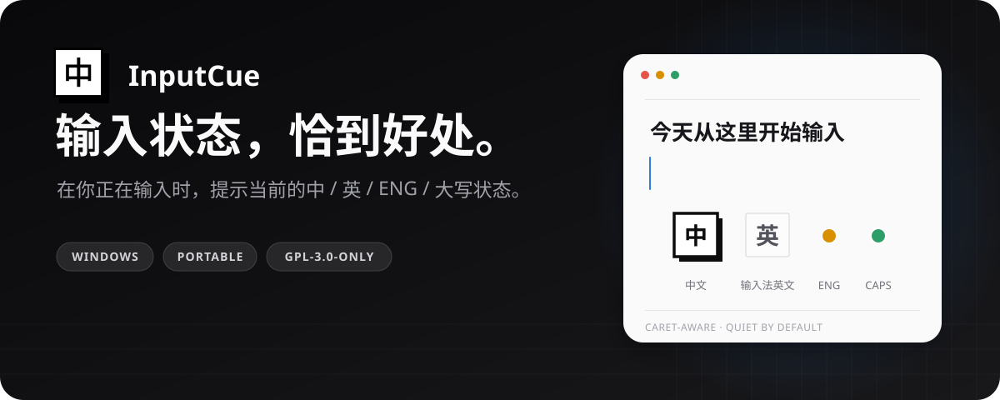
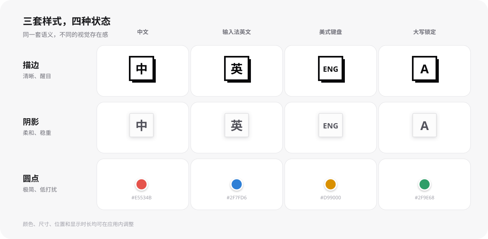
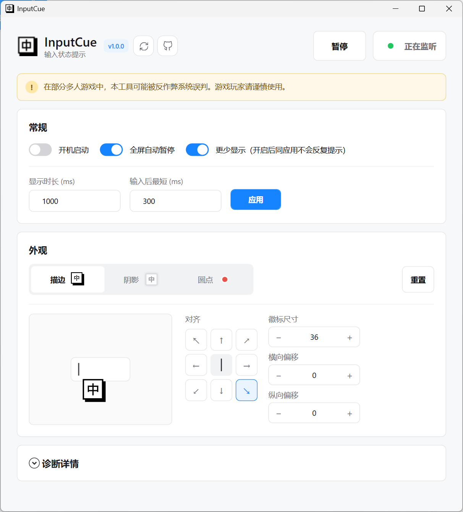

<p align="center">
  
</p>

<p align="center">
  <a href="https://github.com/huangko555/InputCue/releases/latest"><strong>下载绿色便携版</strong></a>
  · <a href="#快速开始">快速开始</a>
  · <a href="#显示逻辑">显示逻辑</a>
  · <a href="./docs/architecture.md">架构设计</a>
</p>

InputCue 是一个克制的 Windows 输入状态提示器。在你正在输入时，它会在光标附近提示中文、输入法英文、美式键盘或大写锁定状态，并综合当前编辑环境与可用位置，尽量减少无关场景的误触发。

> [!WARNING]
> InputCue 会监听系统输入状态并在其他应用上方显示提示。在部分多人游戏中，这类行为可能触发反作弊系统的误判；游戏玩家请谨慎使用，进入游戏前建议退出 InputCue。

## 三套样式，四种状态

<p align="center">
  
</p>

- **描边**：黑白硬阴影，识别度最高。
- **阴影**：浅色卡片与柔和阴影，更自然地融入桌面。
- **圆点**：用四种颜色表达状态，存在感最低。

三套样式都可独立设置位置、偏移与尺寸；圆点还可自定义四种状态颜色。

## 产品界面

<p align="center">
  
</p>

设置页提供实时预览。全屏自动暂停与“更少显示”默认开启，开机启动可按需启用；暂停和监听状态始终在顶部清晰可见。

## 为什么是 InputCue

- **尽量减少误触发**：综合当前编辑环境与显示位置，尽量避免在无关场景弹出提示。
- **四种状态**：区分中文、输入法英文、美式键盘（ENG）和 Caps Lock。
- **更少打扰**：焦点没有离开同一个应用时不反复提示；输入模式改变时仍会提示。
- **全屏自动暂停**：进入视频、游戏等全屏场景自动暂停，退出后自动恢复。
- **受控兼容策略**：在已确认可编辑、但拿不到可靠光标位置的特定场景，可使用鼠标点击位置作为显示锚点。
- **绿色便携**：解压即用，设置保存在程序目录下的 `data/`，无需安装。

## 快速开始

1. 打开 [Releases](https://github.com/huangko555/InputCue/releases/latest)，下载 `InputCue-*-win-x64-portable.zip`。
2. 解压到一个可写目录，不要直接在压缩包内运行。
3. 双击 `InputCue.exe`。首次运行若出现 Windows SmartScreen 提示，请核对下载来源与发布页校验值。

便携版会自动检查更新：启动时检查一次，此后每天最多自动检查一次。无论自动检查还是点击“更新”手动检查，发现新版本后都会验证签名和 SHA-256、下载更新并自动重启。详见[便携发布与自动更新说明](./docs/portable-release-and-update.md)。

## 显示逻辑

InputCue 会综合可编辑状态、输入状态和可用的显示位置，尽量让提示出现在正在输入的位置附近：

```text
确认处于可编辑位置
        ↓
识别当前输入状态
        ↓
可靠光标位置 ──不可用──→ 受控的鼠标锚点回退
        ↓                         ↓
             在目标附近显示提示
                        ↓
               开始输入后自动隐藏
```

鼠标位置只用于决定提示放在哪里，不会被单独用来判断你是否正在输入。缺少必要上下文、状态未知或显示位置不可用时，InputCue 会保持安静，以减少误触发。

## 隐私与边界

InputCue 不记录输入内容，不保存按键历史，也不会自动切换输入法。它只在本机判断当前输入环境并绘制短暂提示。

Windows 应用的输入实现差异很大，因此不能保证覆盖所有软件、所有控件和所有输入法。高权限窗口也可能要求 InputCue 以相同权限运行。兼容性判断与已知边界见[产品定义](./docs/product-definition.md)和[调研结论](./docs/research-basis.md)。

## 开发

需要 .NET SDK `10.0.302` 与 Windows x64 环境。

```powershell
dotnet test InputCue.sln --configuration Release
dotnet run --project src/InputCue.App/InputCue.App.csproj
```

主要文档：

- [架构设计](./docs/architecture.md)
- [开发计划](./docs/development-plan.md)
- [诊断探针](./docs/diagnostic-probe.md)
- [架构决策记录](./docs/adr/)
- [领域词汇](./CONTEXT.md)

## 许可证

InputCue 采用 [GNU General Public License v3.0 only](./LICENSE)（`GPL-3.0-only`）发布。你可以使用、研究、修改和再分发本项目；分发修改版或包含本项目的衍生作品时，需要按 GPL v3 提供对应源代码并保留同一许可证。

便携发行包同时包含 InputCue 许可证、.NET 运行时许可证及第三方声明。其他组件的归属与许可证见 [THIRD-PARTY-NOTICES.md](./THIRD-PARTY-NOTICES.md)。

Copyright © 2026 InputCue contributors.
